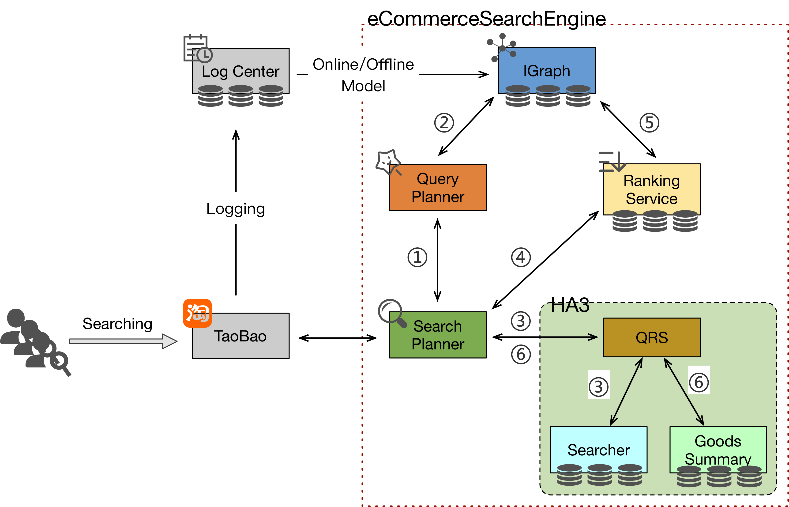
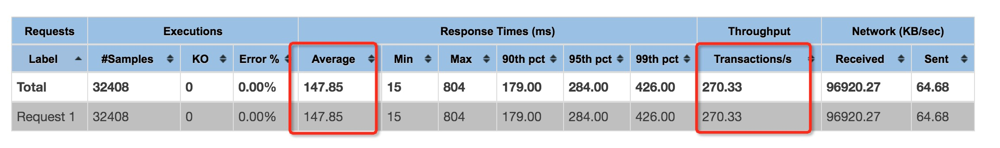
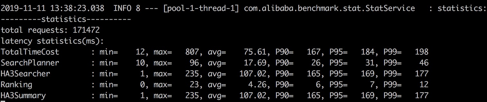

# e-commerce search benchmark

## Introduction

E-commerce search benchmark is the first end-to-end application benchmark for e-commerce search system with personalized recommendations. It helps people deeply understand  the characteristics of workloads for e-commerce search and drives better design options for industry search system.

Features of the benchmark:
* Provides a *Data Generator* using real-world datasets and producing synthetic data of various scales. 
* Provides a *Workload Generator* that driven by the real-world user logs from Taobao.
* Provides a e-commerce search model *eSearchEngineModel* that simulated the search system of Taobao.
* Evaluates the overall performance and performance of individual components.


The e-commerce search benchmark is built on docker images. As shown in the figure above,the benchmark consists of 7 docker images:
1. aliesearch-search-planner
2. aliesearch-query-planner
3. aliesearch-tf-serving
4. aliesearch-ha3
5. aliesearch-ranking-service
6. aliesearch-jmeter-image
7. aliesearch-benchmark-cli

where, images 1~5 constitute the e-commerce search model *eSearchEngineModel*, *`aliesearch-benchmark-cli`* is the *Data Generator*, *`aliesearch-jmeter-image`* drives the workload generated by *Workload Generator* to the  e-commerce search model *eSearchEngineModel*.

## Preparation

### Dependency

The following build tools are required：

- gradle 4.x
- maven 3.x
- docker 17.09+
- jdk8

> Note:
> Make sure you can use docker without `sudo` by running
>
> `sudo usermod -aG docker $USER`

### Build 

Run `build.sh` in *`eSearchEngineModel`* directory to build and publish image, etc. 
- Compile and build docker images

    ```shell
    ./build.sh build
    ```
- Publish the docker images to specified remote docker reposition. If you are only running locally, you can skip this step.

    ```shell
    ./build.sh push ${repo_name}
    ```

## Running benchmark

> Note:
> 
> Correctly value for java maximum memory size must be required, otherwise the docker images won't work. You can set it for temporary by running
>
> `sudo sysctl -w vm.max_map_count=262144`
>
> or you can set it for permanent by directly edit the `/etc/sysctl.conf` file on the host, adding a line as flollow:
>
> `vm.max_map_count = 262144`
>
> and then run 
>
> `sysctl -p`

### Running Example in standalone

1. Copy `appctl.sh` in this directory to your working directory;
2. Pull all the images by running: (If you are only running locally, do skip this step.)
   ```
    sudo ./appctl.sh pull
   ```
3. Start all images and automatically import the default data by running:
   ```
    sudo ./appctl.sh start
   ```
4. Check if all the images are ready to work by running:
   ```
    curl -H 'Content-Type:application/json;charset=UTF-8' -d'
                {"uid":"798", "page":0, "query":"68"}' 172.17.0.6:8080/search
   ```
5. Run an example experiment by jmete:
   - login to 'jmeter-image' by running:
    ```
    sudo docker exec -it aliesearch-jmeter-image bash
    ```
   - run to start the pressure test process by running:
    ```
    cd apache-jmeter-5.1.1
    ./bin/jmeter -n -t search_stress.jmx -l result -e -o report
    ```

### Running Example on k8s

Distributed deployment is also provided depending on k8s, which is more in line with the online environment. The benchmark can be run on a k8s cluster as follows:

1. Copy `k8s.yml` to working directory on k8s master node.
2. Replace the docker images repo configuration in`k8s.yml` with your own repo
3. Pull all images and automatically import the default data by running:
   ```
   sudo kubectl create -f k8s.yml
   ```
4. Check the pods status to ensure that all pods start up properly by running:
   ```
   sudo kubectl get pod
   ```
5. Run an example experiment by jmeter:
    - log in to jmeter pod 
      ```
      sudo kubectl exec -it aliesearch-jmeter-image bash
      ```
    - run to start the pressure test process
      ```
      cd apache-jmeter-5.1.1
      ./bin/jmeter -n -t search_stress.jmx -l result -e -o report
      ```

### Running with Customized Pattern

The benchmark comes with an e-commerce data generator and workloads generator that driven by production data and real-world user queries. There are 4 steps for running an experiment with Customized data scale and workload pattern.

#### 1. Install the benchmark

Start all the images of the benchmark according to the 1~3 steps in *`Running Example in standalone`*

#### 2. Data Generation 

Login to the *`benchmark-cli`* image by running:

```shell
sudo docker exec -ti aliesearch-benchmark-cli bash
``` 

Generate goods and user data , load them into corresponding search components by running:

```shell
vim entrypoint.sh
sh entrypoint.sh ${scale_factor}
```

where, *${scale_factor}* sets the scale factor determining the dataset size (1 scale factor equals 1G goods and 6K user, 10 scale factor equals 10G goods and 60K user,and so on)

#### 3. Workload Generation

Change to the directory *`workload_generator`*, and generate workload for specified hour of one day and specified user scale by running:

```shell
python3 workload_generator -t 21 -u 100000
```

 A *`query_workload.csv`* file will be generated in the directory *`workload_generator`*, which will be driven to system model under test (e.g. *eSearchEngineModel* ).

#### 4. Run experiment by jmeter

Firstly, Copy the generated workload file *`query_workload.csv`*  to jmeter path (*`apache-jmeter-5.1.1/bin/jmeter`*) in jmeter docker.
Then, login to 'jmeter-image' by running:

```shell
sudo docker exec -ti aliesearch-jmeter-image bash
```

And change to the jmeter bin directory, start the pressure test process by running:

```shell
cd apache-jmeter-5.1.1
./bin/jmeter -n -t search_stress.jmx -l result -e -o report
```

### Benchmark Results:Example Output

**1. End-to-end performance metrics**

E-commerce search benchmark use Jmeter as the driver to drive workload described *`query_workload.csv`* to system under test, so the end-to-end performance metrics are displayed by CLI and HTML of Jmeter.
An example CLI of Jmeter CLI report is as following:
>
> l result -e -o repo2rtpache-jmeter-5.1.1$ ./bin/jmeter -n -t search_stress.jmx -l
> Creating summariser <summary>
> Created the tree successfully using search_stress.jmx
> Starting the test @ Wed Nov 13 02:33:53 UTC 2019 (1573612433454)
> Waiting for possible Shutdown/StopTestNow/HeapDump/ThreadDump message on port 4445
>
> summary +     67 in 00:00:06 =   10.7/s Avg:    45 Min:    15 Max:   115 Err:     0 (0.00%) Active: 3 Started: 3 Finished: 0
> summary +   3108 in 00:00:30 =  103.6/s Avg:    40 Min:    13 Max:    97 Err:     0 (0.00%) Active: 8 Started: 8 Finished: 0
> summary =   3175 in 00:00:36 =   87.5/s Avg:    40 Min:    13 Max:   115 Err:     0 (0.00%)    
> summary +   6645 in 00:00:30 =  221.5/s Avg:    40 Min:    12 Max:   134 Err:     0 (0.00%) Active: 10 Started: 10 Finished: 0
>

A detail result is reported by HTML in the report direcoty specified in runnign experiment. An example HTML report of Jmeter is as following:



**2. Response time breakdwon**

All steps of the full search path are logged, the statistical analysis of the breakdown of response time is printed every minute. 
To check the statistics of breakdown time, login to *'aliesearch-search-planner'* by running:

```shell
sudo docker exec -it aliesearch-search-planner bash
```

Then check the statistics in *`out.log`* by running:

```shell
vim out.log
```

and the statistics of breakdown time is recorded as following:



SearchBench specifies an e-commerce search dataset and workloads that driven by production data and real-world user queries, and target at the hardware and software system that provide e-commerce online search service. Therefore, any of those system can be used to establish the feasibility of this benchmark.
