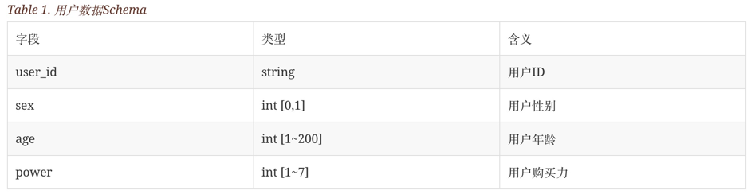
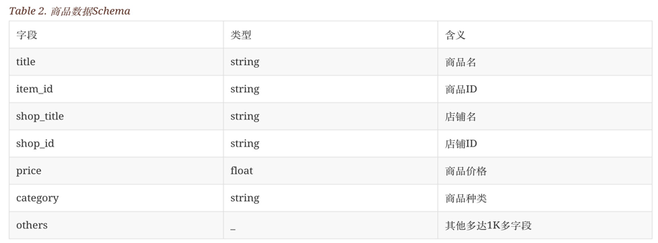

# Data Generator

The Data Generator is responsible for providing the data sets used by the e-commerce search benchmark. This data generator is designed to produce goods data and user data that mimic the characteristics of those of real data from Taobao. Especially,the goods data consisit of three types:
- excellent goods, with high popularity, which ratio is 15%
- good goods, with medium popularity, which ratio is 35%
- bad goods, with low popularity, which ratio is 50%

## Preparation

### Dependency
The following build tools are required：

- gradle 4.x
- maven 3.x
- docker 17.09+
- jdk8

### build

run `bash build.sh` in this directory to complete the compilation and packaging, build image, etc. 

## Data generation

### Data generation in Local 
1. unzip the package

    After building the Data Generator, change to the distribution directory and unzip the package by running:
    ```shell
    cd build/distributions/
    unzip data-generator-1.0-SNAPSHOT.zip
    ```

2. data generation

    ```shell
    ./bin/benchmark-cli generate --scale ${scale_factor}
    ```

    where `${scale_factor}` sets the scale factor determining the dataset size (1 scale factor equals     1G goods and 6K user, 10 scale factor equals 10G goods and 60K user,and so on)

### Data generation in docker
 
If the Data Generator is started by docker, firstly login to the `aliesearch-benchmark-cli` image, then generate special scale datasets and load them into corresponding search components by running:
```shell
sudo docker exec -it aliesearch-benchmark-cli bash
sh entrypoint.sh ${scale_factor}
```

where `${scale_factor}` sets the scale factor determining the dataset size (1 scale factor equals 1G goods and 6K user, 10 scale factor equals 10G goods and 60K user,and so on)

## Data Schema

*eCommerceSearchBench* includes two types of dataset:

- **user data**: the schema of user data includes user id, user gender, age, purchasing power,etc. its schema is as follows:


- **goods data**: the schema of goods dataset comes from real-world by extracting the relevant fields about searching, filtering and sorting. its schema is as follows:

