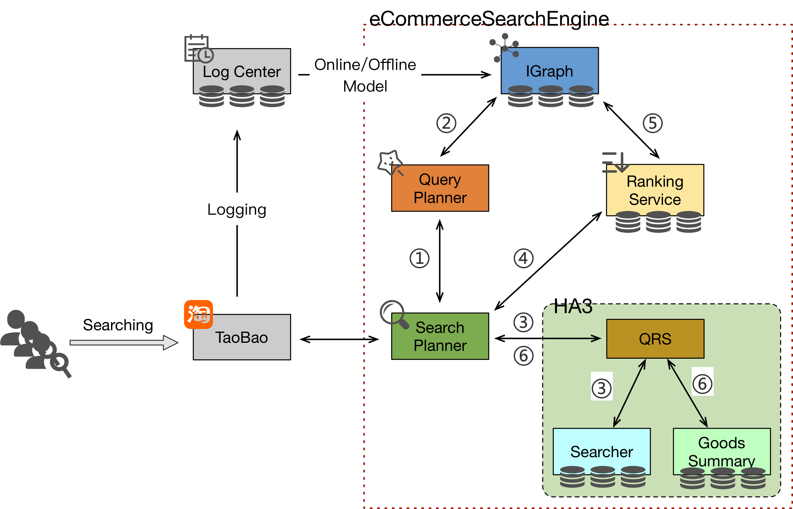

# E-commerce search model

## Introduction
E-commerce search benchmark provides an e-commerce search model that simulated the personalized search system of Taobao. As shown in the figure below, a typical e-commerce search system consists of four submodules including Search Planner, Query Planner, HA3 Searcher, and Ranker.



- *Search Planner(SP)*: SP is the entrance of e-commerce search engine. It is
responsible for receiving the query requests from front-user, scheduling the request to the other components and returning the results to front-user. 
- *Query Planner(QP)*: QP is to analyze the query intention according to the user information obtained from the user database (iGraph), including query spelling correction,category/brand prediction,etc. 
- *HA3 Searcher*: HA3 is the executor of the search query. The process of inverted index recall, statistics, conditional filtering, document scoring and sorting, and summary generation is all done on the HA3 Searcher. The searcher mainly consists of three components:
  - *QRS*, is to receive the query, distribute the query to the Searcher or Summary, collect the results returned by the Searcher or Summary, and finally return them to the user. 
  - *Searcher*, holds the inverted indexes of goods information.In view of the click-through rate and purchase rate, the goods are divided into three categories according to the popularity-high, medium, and low, occupying the proportion of 15%, 35%, and 50%, respectively. 
  - *Summary*, holds the detail of goods. Sometimes a separate Summary cluster is set up based on the needs of the business.
- *Ranker*: Ranker ranks the scores of goods according to the user's age, preference, gender and even click behavior. Not to mention different users, the ranking result is different even the same user's sorting logic after page turning. It holds forward index of goods and implements some ranking algorithm models.

## Implementation

We implement an e-commerce search model for reference as following:


- *Search Planner(SP)*:  The SP is implemented based on Spring Boot framework. And we merge the QRS function in SP which is originally belong to HA3 Searcher. It is provided by *`aliesearch-search-planner`* docker image.
- *Query Planner(QP)*: The QP is implemented based on Spring Boot framework for category prediction, and adopts TensorFlow serving to implement personalized recommendation. The user database is implemented by Neo4j. QP returns two vectors-the probability vector of the predicted categories and the user preference score vector of product attribute, such as the user preference for brand, etc. It is provided by *`aliesearch-query-planner`* and *`tf-serving`* docker images.
- *HA3 Searcher*: HA3 Searcher is implemented based on ElasticSearch. Specially, The inverted indexes of goods with different popularities are stored into different ES clusters, named excellent-goods, good-goods and bad-goods. The Summary is named goods-summary. It is provided by *`aliesearch-ha3`* docker image.
- *Ranker*: The ranker also uses the ElasticSearch to implement goods ranking. It is provided by *`aliesearch-ranking-image`* docker image.

The e-commerce search model consists of the following images:

1. aliesearch-search-planner
2. aliesearch-query-planner
3. aliesearch-tf-serving
4. aliesearch-ha3
5. aliesearch-ranking-service

The searching process is as follows:

1. The *Workload Generator* simulates concurrent users and their queries. The queries will be send to Search Planner;
2. *Search Planner* receives the query and sends it to Query Planner;
3. *Query Planner* first conducts query spelling correction and query rewrite. Then it predicts the belonged category of the query based on classification model-FastText. Meanwhile, QP gets the user information by accessing the Neo4j graph database. And then, QP calculates the sort weight used in the sorting of goods by tf-serving according to the predicted category and user information. It returns two vectors - the probability vector of the predicted categories and the user preference score vector of product attribute to Search Planner, such as the user preference for brand, etc.
4. *Search Planner* sends the query and predicted category results to HA3 Searcher
5. *Searcher* searches the inverted indexes and returns the goods ID to Search Planner. The Searcher searches these three clusters one by one, until reaching a specific amount. To be specific, it firstly searches the high popular goods in excellent-goods cluster, and return the results if they are sufficient; If there is not enough excellent goods, then it searches from good-goods cluster, and return the results if the quantity is enough; If the number of good goods plus that of excellent goods is still not enough, then it searches the bad-goods cluster. The bad-goods cluster that holds low popularity goods is rarely searched in a realistic scenario. 
6. *Search Planner* sends the goods ID and personalized attribute weights to Ranker for precise ranking;
7. *Ranker* ranks the goods according to the initial weights and returns the ranking scores to Search Planner;
8. *Search Planner* pull the detail goods information from Summary cluster;
9. *Search Planner* returns the founded goods information to Workload Generator.

## Build 

### Dependency

The following build tools are required：

- gradle 4.x
- maven 3.x
- docker 17.09+
- jdk8

> Note:
> Make sure you can use docker without `sudo`

### Build
Run `build.sh` in each sub-directory to build image and publish image. 
- Compile and build docker images
    ```
      ./build.sh build
    ```
- Publish the docker images to specified remote docker reposition. If you are only running locally, you can skip this step.
    ```
     ./build.sh push
    ```

## Deployment
> Note:
> 
> Correctly value for java maximum memory size must be required, otherwise the docker images won't work. You can set it for temporary by running
>
> `sudo sysctl -w vm.max_map_count=262144`
>
> or you can set it for permanent by directly edit the `/etc/sysctl.conf` file on the host, adding a line as flollow:
>
> `vm.max_map_count = 262144`
>
> and then run 
>
> `sysctl -p`

### Standalone Deployment

Start all images and automatically import the default data by running

```shell
sudo. /appctl.sh start
```

### K8s Deployment
Distributed deployment is also provided depending on k8s, which is more in line with the online environment:

1. Copy `k8s.yml` to the working directory on k8s master node.
2. Replace the docker images repo configuration in`k8s.yml` with your own repo.
3. Pull all images and automatically import the default data by running:
    ```
   sudo kubectl create -f k8s.yml
    ```
4. Check the pods status to ensure that all pods start up properly by running:
    ```
   sudo kubectl get pod
    ```

